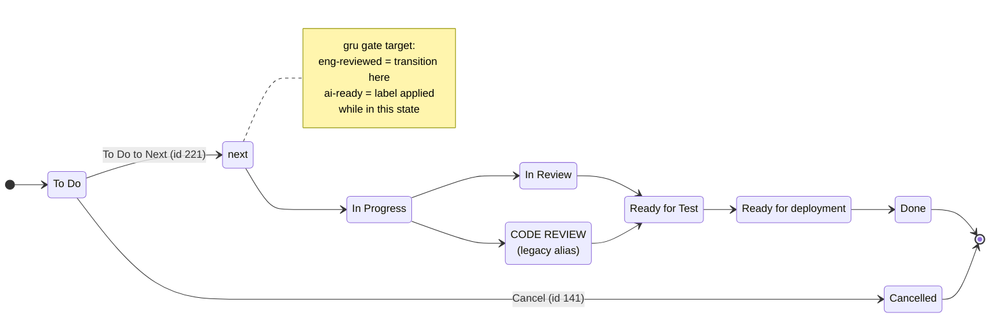

# Jira conventions for gru

> Source of truth for Jira- and Confluence-side conventions. gru skills MUST read values from this file at runtime — never hardcode them. Update this file when conventions change; bump the schema version below if a change is breaking.
>
> **Schema version**: 4
> **Last verified against PLTPM**: 2026-05-03

## Site

- **Cloud ID**: `58863ddf-2ab1-4cdf-bcce-31cf76e6d270`
- **URL**: `https://moneylion.atlassian.net`
- **Jira project in scope**: `PLTPM` ("Payments")

## Confluence

Required by `write-a-prd` (elevated PRDs) and `spike-and-report` (research sub-pages). Skills read these values at runtime; if either is missing or set to `<TBA — bootstrap>`, the skill MUST refuse with a one-line bootstrap pointer ("fill in `## Confluence` in `.agents/jira-conventions.md`").

- **Confluence space key**: `PS1`
- **Confluence space ID**: `5015143175`
- **Spikes parent page ID** (where research sub-pages land when their Research ticket has no Confluence-elevated parent PRD): `6711345211`
- **Spikes parent page title**: `15 - Spikes`

Notes (informational only; skills don't parse these):

- The Payments space's URL alias is `payments`, so its homepage is at <https://moneylion.atlassian.net/wiki/spaces/payments/>. Discovery via `atlassian.getConfluenceSpaces` returns `key: "PS1"` plus `currentActiveAlias: "payments"`.
- `15 - Spikes` is a `folder` content type (not a page), sibling of the other `NN - Section` folders directly under the Payments space homepage (id `5015143454`). `createConfluencePage` accepts a folder id as `parentId`, so spike sub-pages land underneath cleanly.

### Sub-page parent resolution (used by `spike-and-report`)

Three-level walk, first match wins:

1. **Parent PRD has a Confluence page** — the Research ticket is `Implement`-linked to a parent Story / Technical Story whose description carries a Confluence smartlink (the elevated-PRD case from `write-a-prd`). Sub-page parent = that page's id.
2. **Parent PRD inline (no Confluence page)** — the Research ticket has an `Implement` parent, but the parent's PRD lives inline in the Jira description. Sub-page parent = the configured **Spikes parent page id** above.
3. **Orphan Research ticket** — no `Implement` link to any parent. Sub-page parent = the configured **Spikes parent page id** above.

### Discovery (one-time)

To populate the placeholders above, run any of:

- Atlassian MCP: `atlassian.getAccessibleAtlassianResources` → list of cloud IDs; `atlassian.getConfluenceSpaces` for the matching cloud → space list.
- Web UI: <https://moneylion.atlassian.net/wiki/> → space picker → URL bar shows `/spaces/<KEY>/`. Space ID is in the space-settings page URL.
- Spikes parent page: create or pick a Confluence page titled `Spikes` under the chosen space (or wherever the team prefers research sub-pages to live); copy the page id from its URL (`...pageId=<id>`).

## Bootstrap checklist (one-time, manual)

### Jira Components — 4 to create

Admin URL: <https://moneylion.atlassian.net/jira/software/c/projects/PLTPM/components>

The following 4 Components MUST exist in PLTPM. gru skills validate presence at runtime and refuse to create child tickets if any are missing:

- `payment-platform`
- `walletapi`
- `infrastructure`
- `spring-boot-starters`

**Components policy (gru-managed tickets)**: gru tickets carry **exactly one Component**, and it is one of the four repo-shaped values above. gru never sets domain-shaped Components (`Payment Processor(s)`, `Wallet (Payment Methods)`, `Wallet (Transfers)`, etc.); those are owned by humans / existing automation on non-gru tickets. If a human later adds a domain Component to a gru-managed ticket, that's their call — but `prd-to-jira-issues` and `ai-ready-check` only ever read/write the repo Component. The two axes (repo vs. domain) are intentionally orthogonal; gru lives entirely on the repo axis.

### Workflow / link-type sanity check

These were discovered live and should already be configured (no admin work expected). Re-verify if a skill ever fails to find them:

- Status `next` (id `14423`) — used as the post-eng-review queue.
- Transition `To Do to Next` (id `221`) — `To Do` → `next`.
- Link type `Implement` (id `19455`) — outward `implements`, inward `is implemented by`.

## Issue types (PLTPM)

| Logical role          | PLTPM type name      | ID      | Notes                                              |
|-----------------------|----------------------|---------|----------------------------------------------------|
| Parent (user-facing)  | `Story`              | `10001` | Used when PRD is driven by user-facing actors      |
| Parent (internal)     | `Technical Story`    | `10707` | "Involves QA and is (mostly) back-end focussed"    |
| Child (typical)       | `Task`               | `3`     | "Anything that does not involve QA"                |
| Child (QA-involved)   | `Technical Story`    | `10707` | Same type as parent; differentiated by hierarchy   |
| Child (long research) | `Research `          | `10720` | ⚠️ TRAILING SPACE in name — use exactly            |
| Child (design work)   | `Design `            | `10747` | ⚠️ TRAILING SPACE in name — use exactly            |
| Sub-task              | `Sub-task`           | `5`     | The 5 ceremony Sub-tasks                           |

Avoid for gru-driven flow:

- `Epic` — reserved for org-level multi-feature initiatives.
- `Diagnosis` — pre-bug investigation; not part of gru's PRD-driven flow.
- `Analytics ` — analytics team only.
- `Bug` — defects; gru is feature/research-driven, not defect-driven.

### Parent type heuristic

- User-facing actor present in any user story (e.g., "As a customer / agent / merchant, ...") → `Story`.
- All actors are systems / services ("As payment-platform, ...") → `Technical Story`.
- When in doubt → `Story` (lower friction; Stories are more common).

### Child type heuristic

- Default → `Task`.
- Slice involves QA loop and is backend-focused → `Technical Story`.
- Pure research / spike → `Research ` (trailing space).
- Pure design work → `Design ` (trailing space).

## Required custom fields (PLTPM)

> PLTPM marks several Jira custom fields as **required at issue creation time**. gru emitter scripts (`write_jira_prd.py`, `write_jira_children.py`) inject these values into every `atlassian.createJiraIssue` action plan via the shared helper `_lib/required_fields.py`. Without injection, the agent in chat eats an HTTP 400 per attempt (the F1 demo on `PLTPM-21272` proved this — 1 retry on the parent and pre-empted 12 retries on the children).
>
> Defaults below were chosen by the PM during one-time bootstrap (`validate_required_fields.py --bootstrap`); per-PRD overrides flow through `write_jira_prd.py --activity-type "<value>"` (or the equivalent flag for any other field below). Drift against live Jira metadata is detectable via `validate_required_fields.py --drift-check`.

- **`customfield_12881`** — Activity Type
  - Default: `Engineering excellence`
  - Allowed: `New feature`, `Bug fix`, `Customer excellence`, `Engineering excellence`, `Ship & Learn`, `Others`
  - Applies to: `Story`, `Technical Story`, `Task`, `Sub-task`, `Research `, `Design `
  - Wire shape: `object`

Notes (informational; the parser does not consume these):

- The trailing space on `Research ` / `Design ` is intentional — PLTPM's issue-type names carry the space (see `## Issue types (PLTPM)`).
- "Wire shape `object`" means the value is wrapped: `{"customfield_12881": {"value": "Engineering excellence"}}`. Single-select Jira customfields use this shape; free-text fields use `scalar` (bare string).
- The PM's choice of `Engineering excellence` for `PLTPM-21272` reflects compliance-driven internal infra; customer-facing PRDs may legitimately want `Customer excellence` or `New feature` instead — that's the override path.

## Workflow

Discovered PLTPM workflow:



### gru gate mapping

The plan calls for two gates: `eng-reviewed` (human) and `ai-ready` (AI). PLTPM has no dedicated "Ready for Eng Review" or "Ready for Development" statuses, so gru collapses both onto the existing `next` status:

| Gate            | Mechanism                                                                                          | Actor    |
|-----------------|----------------------------------------------------------------------------------------------------|----------|
| `eng-reviewed`  | Engineer transitions ticket `To Do → next` via transition id `221` ("To Do to Next").              | Human    |
| `ai-ready`      | `ai-ready-check` skill validates checklist; on pass, applies `ai-ready` **label**. Status unchanged.| AI       |

**On `ai-ready-check` failure**: skill removes any pre-existing `ai-ready` label and posts a checklist-failure comment. Status unchanged.

**Minion-pickup JQL** (reserved for stage 3):

```
project = PLTPM
  AND status = "next"
  AND labels = "ai-ready"
  AND component in ("payment-platform", "walletapi", "infrastructure", "spring-boot-starters")
  AND issuetype in ("Task", "Technical Story")
```

### Status catalogue

| Name                  | ID      | Category       |
|-----------------------|---------|----------------|
| `To Do`               | `12612` | To Do          |
| `next`                | `14423` | To Do          |
| `In Progress`         | `3`     | In Progress    |
| `In Review`           | `10004` | In Progress    |
| `CODE REVIEW`         | `11801` | In Progress    |
| `Ready for Test`      | `10300` | Done           |
| `Ready for deployment`| `12632` | In Progress    |
| `Done`                | `10001` | Done           |
| `Cancelled`           | `12000` | Done           |

### Transition catalogue (gru-relevant)

| From    | To           | Transition ID | Name             |
|---------|--------------|---------------|------------------|
| `To Do` | `next`       | `221`         | `To Do to Next`  |
| `To Do` | `Cancelled`  | `141`         | `Cancel`         |

(Other transitions exist but aren't in gru's path. Discover and add as needed.)

## Issue links

gru-relevant link types (verified live):

| gru semantic                  | Link type name           | ID      | inward              | outward      |
|-------------------------------|--------------------------|---------|---------------------|--------------|
| Parent ↔ child slice          | `Implement`              | `19455` | `is implemented by` | `implements` |
| Cross-repo dependency         | `Blocks`                 | `10000` | `is blocked by`     | `blocks`     |
| Loose relation / discovery    | `Discovery - Connected`  | `11413` | `is connected to`   | `connects to`|
| Defect created from research  | `Defect`                 | `10407` | `created by`        | `created`    |

⚠️ **Do NOT use** `Polaris work item link` (id `10409`) — it has the same `implements` semantics as `Implement`, but is reserved for Jira Polaris. gru always uses `Implement`.

### `createIssueLink` directionality

The Atlassian MCP convention: `inwardIssue` is the blocker / parent, `outwardIssue` is the blocked / child.

For gru's parent → child `Implement` link:

```
inwardIssue  = <parent-key>   # the one being implemented
outwardIssue = <child-key>    # the one doing the implementing
type         = "Implement"
```

Reads as: "child implements parent" / "parent is implemented by child".

For `is blocked by` between sibling children:

```
inwardIssue  = <blocker-key>
outwardIssue = <blocked-key>
type         = "Blocks"
```

## Labels

gru-relevant labels (verified live):

| Label      | Owner                | Meaning                                                                                       |
|------------|----------------------|-----------------------------------------------------------------------------------------------|
| `ai-ready` | `ai-ready-check` skill | Child ticket has passed all `ai-ready-check` checklist items. Required by the minion-pickup JQL. |

**Lifecycle**: humans add `ai-ready` to a child ticket when they want it gated; `ai-ready-check` validates the checklist and either keeps the label (on pass) or removes it (on fail) while posting a structured comment.

**Per-skill rules**:
- `ai-ready-check` only adds/removes `ai-ready`. It never touches other labels.
- `prd-to-jira-issues` and `write-a-prd` do not set any labels.
- `spike-and-report` does not set any labels.

Other labels in PLTPM (e.g., team labels, release labels) are owned by humans / existing automation and gru never reads or writes them.

## Ceremony Sub-tasks

When creating a child issue of type `Task` or `Technical Story`, gru auto-creates exactly these 5 Sub-tasks under it (verified against PLTPM-21031, -21032, -20920, -20921, -20922):

1. `Development`
2. `Code Review 1`
3. `Code Review 2`
4. `Test case creation`
5. `Test case execution`

Sub-tasks are created with empty descriptions and no assignee. Field defaults inherited from the parent.

Children of type `Research ` and `Design ` do NOT get ceremony Sub-tasks (no QA loop).

## Title conventions

Observed in real PLTPM tickets (PLTPM-20121, -20918, -21241):

- **Backend feature work**: prefix `[BE]`. Example: `[BE] Extend payment-platform processor-health client for merchant scope, DEGRADED, and reason codes`.
- **Multi-prefix when narrower**: `[BE][Transfer V2]`, `[BE][V3]`. Use sparingly.
- **Research tickets**: prefix `Spike:` or `Research:`. No `[BE]` — research tickets are not yet repo-scoped.
- **Design tickets**: prefix `Design:`.

Title length: aim for ≤ 100 chars. Hard cap at 255 (Jira summary limit).

## "Significant PRD" heuristic

PRD content lives **inline** in the parent Story / Technical Story description by default. Elevate to a Confluence page only if **any** of:

- The PRD contains > 10 distinct user stories.
- The PRD contains a system-architecture diagram (mermaid > 30 lines, or a Confluence-specific diagram type).
- The PRD has > 3 Cross-Application Impact entries with non-trivial detail.
- The PM explicitly tags the PRD as "elevate to Confluence" during the interview.

When elevated, the parent ticket description becomes a short summary + a Confluence smartlink to the full page. Children always reference the parent ticket key, not the Confluence page (so the Implement link remains the source of truth).

(Heuristic to be tuned after the first 2-3 real runs. Track outcomes in [`../docs/plan.md`](../docs/plan.md) → "Open setup details to resolve during bootstrap".)

## Discovered: existing PRD-driven ticket format

PLTPM already has tickets authored in gru-compatible format (e.g., PLTPM-21241). Observed sections in child descriptions:

- `## Parent PRD`
- `## What to build`
- `## Acceptance criteria` (with `[ ]` checkboxes)
- `## Out of scope`
- `## Technical notes` (optional)
- `## Blocked by`
- `## User stories addressed`

This validates gru's planned child structure. Skills should match this format exactly (engineers won't see a stylistic difference between AI-drafted and human-drafted children).
