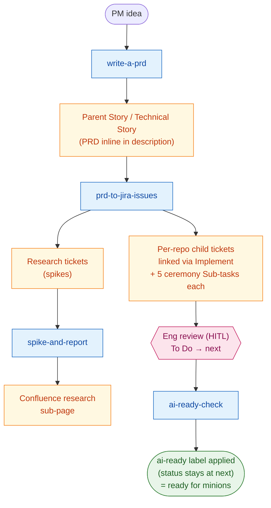
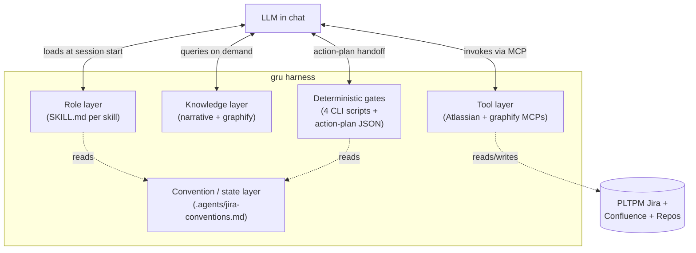

<h1>
  
  &nbsp;gru
</h1>

> *"My minions, assemble!"*

`gru` is an **LLM-agent harness** for the AI sprint pipeline — the scaffolding that turns a general-purpose LLM (Cursor / Claude Code) into a reliable worker for PLTPM Jira and Confluence work. It orchestrates the **idea → groomed Jira tickets** flow: PM interview, cohesion-aware PRD, per-repo ticket slicing, and an explicit `ai-ready` contract. The actual implementation loop — the **minions** that pick up `ai-ready` tickets and ship PRs — is a deferred, separable PoC. gru's outputs are designed to be the minions' inputs unchanged.

## Status

Proof-of-concept, stages 1–2 only. Active product repos in scope:

- `payment-platform`
- `walletapi`
- `infrastructure`
- `spring-boot-starters`

Stage 3 (the minions) is intentionally out of scope — see [`docs/plan.md`](docs/plan.md) for the full rationale.

## Out of scope (PoC)

Things gru deliberately is NOT, so contributors don't propose them as features:

- **Stage 3 minions** — implementation agents picking up `ai-ready` tickets and shipping PRs. Deferred; see [`docs/plan.md`](docs/plan.md).
- **Subagents / multi-agent orchestration** — gru runs as a single LLM session per skill invocation. Parallel TOOL calls (e.g., per-blocker fetches, batched graphify queries) happen at the MCP layer, but no spawned subagents. Stage 3 is where subagent patterns will naturally emerge.
- **Test harness against live PLTPM** — the unit-test suites under each skill exercise scripts against fixtures only. End-to-end verification is the demo dry-run (plan item 14), not an automated suite.
- **Cross-skill orchestrator** — no meta-agent strings the four skills together. The redline checkpoints between skills are the design.
- **Editing files in product repos** — `payment-platform`, `walletapi`, `infrastructure`, `spring-boot-starters` are read-only to gru. `spike-and-report` throwaway worktrees are the one exception, and they enforce no-PR.

## What gru does



Four skills do the work, all under [`.agents/skills/`](.agents/skills):

| Skill | Purpose |
|---|---|
| `write-a-prd` | Interviews the PM, queries the cohesion KB, writes a parent Jira Story / Technical Story with an AI-optimized description. Elevates to Confluence only if the PRD is "significant". |
| `prd-to-jira-issues` | Reads the parent, queries the cohesion KB for slice boundaries, creates per-repo child tickets with the `implements` link, the right Component, the 5 ceremony Sub-tasks, and any `is blocked by` chains. Opens Research tickets for spike work. |
| `spike-and-report` | Operates on Research tickets. Runs in a throwaway worktree, grounds itself in the KB, produces a Confluence research sub-page, and links it back to the Research ticket. No PR. |
| `ai-ready-check` | Enforces the `ai-ready` checklist. On pass: applies the `ai-ready` label and transitions the ticket to "Ready for Development". On fail: removes the label and posts a comment with what's missing. |

## Architecture

gru is a **harness** in the LLM-agent sense — the scaffolding around an LLM that turns it into a reliable domain worker. It's composed of five layers, each independently testable, joined by a single typed handoff (action-plan JSON between the LLM and the deterministic gates).

| Layer | Role | Where it lives |
|---|---|---|
| Role | Tells the LLM what task it's doing and how | `SKILL.md` + `REFERENCE.md` + `EXAMPLES.md` triples in [`.agents/skills/`](.agents/skills) |
| Knowledge | Cross-app context the LLM can't memorize | [`knowledge/narrative/`](knowledge/narrative) + the graphify MCP over `~/payments-graph/` |
| Tools | Lets the LLM act on the world | Atlassian MCP (Jira + Confluence), graphify MCP — pre-wired in Cursor / Claude Code |
| Deterministic gates | Refuses / validates / re-prompts so the LLM can't drift | Python CLIs in `.agents/skills/*/scripts/` emitting action-plan JSON |
| Convention / state | Shared facts both the LLM and the gates read at runtime | [`.agents/jira-conventions.md`](.agents/jira-conventions.md) (sentinel-tested, schema-versioned) |



Distinctive design choices the harness makes:

- **Skill-shaped, not monolithic.** Each skill is a separately-loadable role; the LLM picks one based on the user's prompt and the others stay invisible.
- **Deterministic Python gates instead of LLM-judged predicates.** Anywhere correctness matters (canonical Components, AC presence, blocker statuses, marker idempotency) is computed by a script. The LLM owns prose and decisions; the scripts own predicates. Action-plan JSON is the typed handoff.
- **Human-in-the-loop checkpoints**, not full autonomy. Redline files in `drafts/` and `redlines/` gate the publish step in three of the four skills.
- **Read-only product repos.** `payment-platform`, `walletapi`, `infrastructure`, `spring-boot-starters` are never written to from gru. `spike-and-report` worktrees are the one exception, and they enforce no-PR via `push.default=nothing`.
- **Sentinel-tested constants** pinned to [`.agents/jira-conventions.md`](.agents/jira-conventions.md) so script-level constants and the conventions doc can't drift silently.

## Cohesion knowledge base

gru does not store code. It reads cross-app cohesion via [graphify](https://github.com/safishamsi/graphify) over a merged corpus at `~/payments-graph/` (the four product repos as siblings). graphify maintains the structural graph (god nodes, edges, wiki articles, MCP server). gru contributes only the **narrative layer** that graphify can't infer:

- [`knowledge/narrative/flows/`](knowledge/narrative/flows) — mermaid sequence diagrams of critical cross-app runtime flows.
- [`knowledge/narrative/glossary.md`](knowledge/narrative/glossary.md) — cross-app semantic mismatches.
- [`knowledge/narrative/repos/`](knowledge/narrative/repos) — short README-style overview per product repo (purpose, owners, conventions, tribal knowledge).

## Prerequisites

1. **Cursor IDE** with this repo opened as the workspace.
2. **graphify** installed globally per its [install docs](https://github.com/safishamsi/graphify), and a populated `~/payments-graph/` parent directory containing the four product repos.
3. **Atlassian MCP** authenticated in Cursor (Jira + Confluence access for the relevant projects).
4. **Claude Code** or **Cursor agent** (skills work in both — symlinks at `.cursor/skills` and `.claude/skills` point to `.agents/skills`).

## Quick start

```bash
git clone https://github.com/fvoon/gru.git
cd gru

# one-time bootstrap of ~/payments-graph/ + graphify install
./scripts/setup-graphify.sh

# follow the printed next-steps to run /graphify . in Claude Code,
# then start a maintenance watcher in a background terminal:
cd ~/payments-graph && graphify --watch .

# back in the gru workspace, in Cursor IDE chat:
# "Use the write-a-prd skill, I want to add <feature>."
```

Detailed PM and engineer onboarding lives in [`docs/usage.md`](docs/usage.md) (TBA — see plan).

## Repo layout

```
gru/
├── README.md             # this file
├── AGENTS.md             # rules for working in gru itself
├── docs/
│   ├── plan.md           # the authoritative plan
│   └── usage.md          # PM + engineer onboarding (TBA)
├── .agents/
│   ├── skills/           # skill SKILL.md packages
│   └── jira-conventions.md
├── .cursor/skills  → ../.agents/skills   # symlink for Cursor IDE
├── .claude/skills  → ../.agents/skills   # symlink for Claude Code
├── knowledge/
│   └── narrative/        # hand-curated context graphify can't infer
└── scripts/              # reserved for the future minion dispatcher
```

## Why "gru"

gru gives orders. The minions execute. For now, gru only gives orders to humans (PMs, engineers) and to itself (skills calling skills, MCP-backed). When stage 3 lands, the same orders will go to long-running implementation agents that pick up `ai-ready` tickets and ship PRs. **gru is the harness; the minions are the workers.** The contract between gru and its minions — the `ai-ready` ticket — is the single most important thing this repo gets right.

## Contributing

This is a working repo, not a deliverable. Treat [`docs/plan.md`](docs/plan.md) as the source of truth for *what* and *why*. Update the plan when scope or design changes; keep skills and narrative layer in sync with it.

## License

MIT — see [`LICENSE`](LICENSE).
