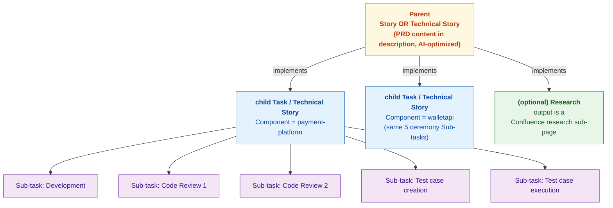
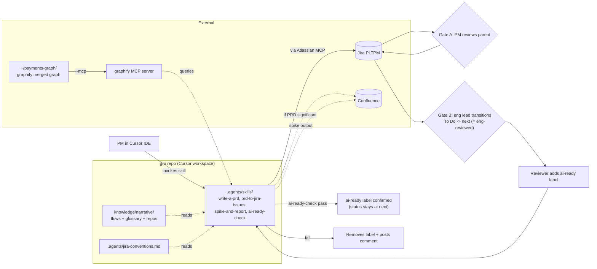

# AI Sprint Pipeline PoC — `gru`

`gru` is a standalone repo that orchestrates the idea → groomed-tickets pipeline. It commands no minions yet — the actual implementation loop (the minions) is a future PoC. For now, gru's job is to interview PMs, build a cohesion-aware PRD, slice it into per-repo Jira tickets that follow team conventions, and gate them with an explicit `ai-ready` contract that future minions will consume unchanged.

## Why this scope

All three pain points raised in the original brief live upstream of code:

- (i) PMs lack cross-application cohesion knowledge — addressed by a live graphify knowledge graph + narrative layer + the PRD interview.
- (ii) Eng feasibility only surfaces at grooming — addressed by an explicit eng-reviewed gate per child issue (Jira workflow status transition).
- (iii) No prototyping practice for integration tickets — addressed by an active `spike-and-report` skill that grounds research in the graph and produces Confluence research sub-pages, operating on first-class `Research` issue tickets.

The implementation loop ("minions ship a PR") is a separable bet with different risks (Maven build times, Java codegen quality, worktree mgmt, Bedrock cost per failed run). It's deferred. The `ai-ready` contract and the cohesion KB are designed so that future PoC consumes the output of this one unchanged.

## `gru` repo structure

```
gru/
├── README.md                 # gru in a nutshell + the minions metaphor
├── AGENTS.md                 # rules for working in gru itself
├── docs/
│   ├── plan.md               # this file
│   └── usage.md              # PM and engineer onboarding (TBA)
├── .agents/
│   ├── skills/
│   │   ├── write-a-prd/
│   │   ├── prd-to-jira-issues/
│   │   ├── spike-and-report/
│   │   └── ai-ready-check/
│   └── jira-conventions.md
├── .cursor/skills  -> ../.agents/skills  # symlink for Cursor IDE
├── .claude/skills  -> ../.agents/skills  # symlink for Claude Code
├── knowledge/
│   └── narrative/
│       ├── README.md
│       ├── flows/
│       │   ├── wallet-topup.md
│       │   ├── transfer-authorization.md
│       │   └── ach-return.md
│       ├── glossary.md
│       └── repos/
│           ├── payment-platform.md
│           ├── walletapi.md
│           ├── infrastructure.md
│           └── spring-boot-starters.md
└── scripts/
    └── (placeholder for future stage 3 minion dispatcher)
```

### What lives outside `gru`

- `**~/.claude/skills/graphify/**` — graphify itself, installed globally per its docs. Not part of gru.
- `**~/payments-graph/**` — merged-corpus parent dir with the 4 product repos as siblings. Maintained by graphify (`--watch` or per-repo post-commit hook). Not part of gru.
- `**payment-platform`, `walletapi`, `infrastructure`, `spring-boot-starters**` — the target product repos. gru references them by name in `knowledge/narrative/repos/` and reads them via graphify; gru has no file-system dependency on them.

### How a PM uses `gru`

1. Open `gru` in Cursor IDE (it's the active workspace during PoC work).
2. Ensure `~/payments-graph/` exists and graphify is running (`graphify --watch ~/payments-graph/` in a background terminal).
3. Invoke a skill in the chat: e.g., "use the `write-a-prd` skill, I want to add real-time wallet balance updates for transfers."
4. Skill outputs go to Jira and (optionally) Confluence via the Atlassian MCP. Nothing is committed to a product repo at this stage.

## Jira hierarchy used by the AI workflow




Cross-child ordering between siblings uses `is blocked by` (e.g., publisher Task blocks consumer Task). `Epic` is reserved for loftier multi-feature initiatives and is **not** used by the typical AI workflow.

### Parent type selection heuristic

`write-a-prd` auto-picks; reviewer can override:

- User-facing actor in user stories (customer, member, app user) → `Story`
- Internal/system actor (engineer, on-call, system, ops) → `Technical Story`
- Tie / ambiguous → `Technical Story` (more conservative; PLTPM defines it as "involves QA and is back-end focussed", which matches our typical work)

### Child type selection heuristic

`prd-to-jira-issues` auto-picks per slice:

- Slice involves QA verification → `Technical Story`
- Slice is engineering-only (refactor, infra, config, no user-visible behavior change) → `Task`
- Slice is exploratory / open-ended → `Research`  (trailing space — see `[.agents/jira-conventions.md](../.agents/jira-conventions.md)`)
- Slice is a focused design artifact → `Design`  (trailing space — same)

## Workflow at a glance




## Decisions locked in

- **Scope**: stages 1-2 only (idea → groomed tickets). Stage 3 (minions / implementation loop) is out of scope.
- **Repo home**: standalone `gru` repo at [https://github.com/fvoon/gru](https://github.com/fvoon/gru). Skills + narrative layer + conventions all live here. Cursor and Claude Code consume skills via `.cursor/skills` and `.claude/skills` symlinks to `.agents/skills/`.
- **Product repos in scope**: `payment-platform`, `walletapi`, `infrastructure`, `spring-boot-starters`. Referenced by name in `gru`; not file-system dependencies.
- **Runtime**: Cursor IDE / Claude Code routed through litellm to AWS Bedrock.
- **Cohesion KB substrate**: `[safishamsi/graphify](https://github.com/safishamsi/graphify)`, single merged graph at `~/payments-graph/`. Live MCP server (`--mcp`) as primary query interface. `--watch` (or per-repo post-commit hook) keeps it current.
- **Narrative layer**: `gru/knowledge/narrative/` — `flows/`, `glossary.md`, `repos/`. Defer `events-overrides.md` and `pitfalls.md` until graphify gaps justify them.
- **Jira project**: `PLTPM` (Payments).
- **Parent**: `Story` (user-facing) or `Technical Story` (engineering). PRD content lives in parent description (Markdown, AI-optimized). Confluence elevation is opt-in for "significant" PRDs only.
- **Children**: per-repo `Task` / `Technical Story` / `Research`  / `Design`  (Research and Design have a trailing space in their PLTPM type names — see `[.agents/jira-conventions.md](../.agents/jira-conventions.md)`), linked to parent via `Implement` link type (outward `implements`, inward `is implemented by`). Cross-child ordering via `Blocks` (`is blocked by`).
- **Repo identification**: Jira `Component` per child. Exactly **one** Component per gru-managed ticket, and it is one of the 4 repo-shaped values (`payment-platform`, `walletapi`, `infrastructure`, `spring-boot-starters`) — gru never sets PLTPM's existing domain-shaped Components (`Payment Processor(s)`, `Wallet (Transfers)`, etc.). The two axes (repo vs. domain) are orthogonal; gru lives entirely on the repo axis. Bootstrap todo: create the 4 repo-shaped Components in PLTPM.
- **Ceremony**: every `Task` and `Technical Story` child auto-receives 5 standard Sub-tasks (Development, Code Review 1, Code Review 2, Test case creation, Test case execution). `Research`  and `Design`  children skip the ceremony.
- **Gates** (collapsed onto PLTPM's actual workflow `To Do → next → In Progress → ...` since PLTPM has no dedicated "Ready for Eng Review" / "Ready for Development" statuses): `eng-reviewed` = engineer transitions ticket from `To Do → next` (transition id `221`, "To Do to Next"). `ai-ready` = `ai-ready-check` skill applies the `ai-ready` label while ticket remains in `next` (no further transition). Minion-pickup JQL keys on `(status = next AND labels = ai-ready)`.
- **Spike output**: Confluence research sub-page linked from the `Research` ticket; comment on the ticket with the link.
- **Jira / Confluence surface**: Atlassian MCP (`plugin-atlassian-atlassian`).
- **Cross-repo handling**: 1 child ticket = 1 Component = 1 future PR. Cross-app features become per-repo sibling children of the same parent, with `is blocked by` chains representing producer/consumer ordering.

## Pieces to build (todos)

1. `**gru` repo scaffold** — directory layout, symlinks, README + AGENTS.md framing the metaphor, LICENSE, .gitignore, empty `scripts/` placeholder.
2. **Graphify bootstrap** — stand up `~/payments-graph/` with the 4 product repos as siblings; install graphify; run `/graphify .`; review GRAPH_REPORT.md.
3. **Graphify maintenance ritual** — `--watch` or per-repo post-commit hooks; document in `knowledge/narrative/README.md`.
4. **Jira bootstrap** — ✅ workflow statuses discovered (`To Do → next → In Progress → ...`); ✅ `Implement` link type confirmed; ⚠️ 4 repo-shaped Components need to be created via Jira admin (`payment-platform`, `walletapi`, `infrastructure`, `spring-boot-starters`).
5. **Narrative — flows** — ⚠️ DRAFTED, pending PM/eng review: `wallet-topup`, `transfer-authorization`, `ach-return` (each carries `<!-- TODO -->` markers for second-hand assumptions). Pick remaining 0-2 with PMs after review.
6. **Narrative — glossary** — cross-app semantic mismatches, seeded from graphify god nodes.
7. **Narrative — repos** — short README-style overview per product repo.
8. **Conventions** — `.agents/jira-conventions.md` (status names, Component mapping, parent/child heuristics, link types, ceremony sub-tasks).
9. **Skill: `write-a-prd`** — graphify-aware PRD interview, writes Story/Technical Story directly in Jira.
10. **Skill: `prd-to-jira-issues`** — graphify-grounded slicing, per-repo child Tasks linked via `implements`, ceremony Sub-tasks, `is blocked by` chain, Research siblings.
11. **Skill: `spike-and-report`** — operates on Research issue type, throwaway worktree, no PR, Confluence research sub-page.
12. **Skill: `ai-ready-check`** — checklist enforcement, label + status transition on pass.
13. **Usage doc** — `docs/usage.md` PM/engineer onboarding guide.
14. **Demo dry-run** — end-to-end against PLTPM with a real cross-repo feature.

## Skill authoring conventions

All skills authored under `gru/.agents/skills/` MUST follow the conventions in the AI Hero [write-a-skill](https://github.com/ai-hero-dev/cohort-003-project/blob/live-run-through-modified/.claude/skills/write-a-skill/SKILL.md) skill. Concretely:

- **SKILL.md frontmatter**: `name` and `description`. Description is max 1024 chars, third person, first sentence states what it does, second sentence is "Use when [specific triggers]". This is the only thing the agent sees when deciding which skill to load.
- **SKILL.md ≤ 100 lines.** If the skill needs more, split into:
  - `REFERENCE.md` — detailed docs.
  - `EXAMPLES.md` — usage examples.
  - `scripts/` — utility scripts for deterministic operations (validation, formatting, anything that would otherwise be regenerated repeatedly).
- **SKILL.md sections**: `# Skill Name` → `## Quick start` (minimal working example) → `## Workflows` (step-by-step processes; use checklists for complex tasks) → `## Advanced features` (link to separate files).
- **No time-sensitive info, consistent terminology, concrete examples, references one level deep.**
- **Add scripts when** the operation is deterministic, repeated code generation would happen otherwise, or errors need explicit handling. Scripts save tokens and improve reliability vs. generated code.
- **Review checklist** before committing each skill (matches cohort-003-project):
  - Description includes triggers ("Use when...")
  - SKILL.md under 100 lines
  - No time-sensitive info
  - Consistent terminology
  - Concrete examples included
  - References one level deep

The plan's per-skill detail sections below describe **what** each skill does. The actual `SKILL.md` files authored during execution will follow the structure above; the detail sections here are not the SKILL.md content.

## Skills detail

### `write-a-prd/SKILL.md`

Adapts AI Hero `write-a-prd`. Key differences:

- **Affected-apps inference via graphify MCP**: at the start of the interview, queries the graph for related concepts/modules across the 4 product repos. Surfaces a "likely affected apps + integration points" summary; PM confirms before deep-diving.
- **Reads narrative on demand**: opens matching `knowledge/narrative/flows/<flow>.md` / `knowledge/narrative/glossary.md` when the interview hits relevant cross-app flows or ambiguous terms.
- **Auto-picks parent type** per the heuristic above; PM can override.
- **Significance check**: at end of interview, decides whether to elevate to Confluence based on PRD size + cross-app complexity + explicit PM flag. Default is inline in the parent description.
- **Final write step (default path)**: `createJiraIssue` with type `Story` or `Technical Story`, description = AI-optimized PRD Markdown (see structure below). No Confluence page.
- **Final write step (significant path)**: `createConfluencePage` (PRD body) → `createJiraIssue` parent with description = condensed problem statement + scope + cross-app impact summary + Confluence link → `createIssueLink` (Confluence remote link).

**Parent description structure** — adheres to the AI Hero [write-a-prd](https://github.com/ai-hero-dev/cohort-003-project/blob/live-run-through-modified/.claude/skills/write-a-prd/SKILL.md) PRD template, with gru-specific additions clearly marked. "AI-optimized" means structured Markdown an agent can parse cleanly — not a divergence from the upstream template. **User stories live on the parent**; acceptance criteria live on each child (consistent with how `prd-to-issues` cross-references stories by number).

```
## Problem Statement
The problem the user is facing, from the user's perspective.

## Solution
The solution to the problem, from the user's perspective.

## User Stories
A LONG, numbered list of user stories. Each in the format:
1. As <actor>, I want <feature>, so that <benefit>
2. ...
(Extensive; covers all aspects of the feature. Drives the parent type heuristic — user-facing actors → Story, internal/system actors → Technical Story.)

## Cross-Application Impact   <!-- gru addition -->
- payment-platform: <what changes, which modules, which events>
- walletapi: <...>
- (etc.)

## Implementation Decisions
- Modules to be built/modified
- Interfaces of those modules
- Architectural decisions, schema changes, API contracts, specific interactions
- (Do NOT include file paths or code snippets — they go stale fast.)

## Out of Scope
What's explicitly excluded from this PRD.

## Further Notes
Anything else.

## References   <!-- gru addition -->
- Confluence: <link if elevated>
- graphify wiki nodes: <...>
- Narrative flows: <...>
- Related ADRs: <...>
```

### `prd-to-jira-issues/SKILL.md`

Adapts AI Hero `prd-to-issues`. Key differences:

- Input is a parent Story / Technical Story key. Fetches via `getJiraIssue`. Also reads linked Confluence PRD if present.
- **Slice boundaries grounded in graphify**: queries the MCP server for module ownership of each touched concept. Surfaces dependency edges to inform the `is blocked by` chain.
- **For features touching >1 repo**: optionally creates a contract Confluence sub-page (only if cross-app contract is non-trivial; otherwise the contract goes inline into each child description).
- **Per-repo child creation**: `createJiraIssue` per slice with:
  - Issue type per child heuristic (`Task` / `Technical Story` / `Research`  / `Design`  — note trailing space on the latter two).
  - **Exactly one** `Component`, set to the in-scope repo name (`payment-platform`, `walletapi`, `infrastructure`, or `spring-boot-starters`). Never a domain-shaped Component.
  - Description = self-contained, AI-copyable prompt (see structure below).
  - Link to parent via `createIssueLink` type `Implement` (`inwardIssue` = parent, `outwardIssue` = child). Reads as "child implements parent".
  - Title prefix `[BE]` for backend slices, `Spike:` / `Research:` for research, `Design:` for design.
- **Ceremony Sub-tasks**: for every `Task` and `Technical Story` child, auto-creates the 5 standard Sub-tasks.
- **Ordering**: creates `is blocked by` links between siblings per the dependency graph.
- **Spike slices**: when the PRD calls for research, creates a `Research` ticket as a child of the parent. Does NOT create ceremony Sub-tasks under Research.
- Does NOT auto-apply `ai-ready`. Does NOT transition status (the eng-reviewed transition is a human action).

**Child description structure** — adheres to the AI Hero [prd-to-issues](https://github.com/ai-hero-dev/cohort-003-project/blob/live-run-through-modified/.claude/skills/prd-to-issues/SKILL.md) issue template, with gru-specific additions clearly marked. Self-contained so a future minion can pick up the child without traversing back to the parent.

```
## Parent PRD
<PARENT-KEY>

## What to build (in <repo>)
A concise description of this vertical slice, end-to-end behavior. Reference parent sections rather than duplicating prose.

## Background (auto-snapshot from parent — do not edit)   <!-- gru addition -->
<Problem Statement + Cross-App Impact for THIS repo, lifted from parent so a minion has full context without traversing the link>

## Acceptance criteria
- [ ] Criterion 1 (testable; suggested test: <name>)
- [ ] Criterion 2
- [ ] Criterion 3

## Implementation Hints (graphify-derived)   <!-- gru addition -->
- Modules to touch: <...>
- Events emitted/consumed: <...>
- Existing similar code: <graphify node refs>

## Out of Scope (this slice)   <!-- gru addition -->
- <Explicitly punted; handled by sibling: <SIBLING-KEY>>

## Blocked by
- <SIBLING-KEY> (if any), or "None — can start immediately"

## User stories addressed
Reference by number from the parent PRD:
- User story 3
- User story 7
```

### `spike-and-report/SKILL.md`

For `Research` issue type tickets. Optional / opt-in (PM or eng explicitly invokes against a Research ticket key).

- **Grounds in graphify first**: queries MCP for the existing state of the relevant module(s).
- Creates a **throwaway** worktree (`spike/<JIRA-KEY>`) — explicitly named so no one mistakes it for production work. Hard guardrails:
  - **No PR is ever opened.**
  - Hard budget: max 30 turns or 30 minutes wall-clock, whichever first.
  - Allowed to read/grep across all 4 in-scope repos; allowed to write throwaway code in the worktree only.
- Produces a **Confluence research sub-page** as a child of the parent Story (or as a standalone page in the project space if the Research ticket has no parent). Structure:
  - What the question was (copied from the Research ticket).
  - Existing state from graphify (auto-included; gives reviewers grounding).
  - What was tried (with code excerpts, not full file dumps).
  - What worked / what didn't.
  - Recommended approach + recommended contract changes.
  - Suggested follow-up AFK tickets (titles + AC) — to be created by a human via `prd-to-jira-issues` re-run, not by the spike skill itself.
- On completion: `addCommentToJiraIssue` on the Research ticket with the Confluence link, and `transitionJiraIssue` to "Done".

### `ai-ready-check/SKILL.md`

Enforces the `ai-ready` contract. Triggered on demand against a child ticket key.

Checklist (all must pass):

- Acceptance criteria are present, testable, and at least one explicit test name is suggested.
- All `is blocked by` tickets are in `Done` state.
- Exactly one Component is set, and it is one of the 4 repo-shaped values (`payment-platform`, `walletapi`, `infrastructure`, `spring-boot-starters`). gru-managed tickets do not carry domain-shaped Components.
- Ticket is linked to a parent via the `Implement` link type (outward `implements` from child to parent).
- Status is `next` (which means the engineer has already eng-reviewed it; see `[.agents/jira-conventions.md](../.agents/jira-conventions.md)` for the gate mapping).
- Issue type is `Task` or `Technical Story` (`Research`  and `Design`  children are never `ai-ready`).

Behavior:

- On all-pass: `addCommentToJiraIssue` with checklist results, applies `ai-ready` label via `editJiraIssue`. Status stays at `next` (no further transition — minions pick up from here in stage 3).
- On any-fail: posts a comment listing failed items, removes the `ai-ready` label if present. Status unchanged.

## HITL gates

- **Gate A — after PRD interview, before `prd-to-jira-issues`**: PM reviews the parent Story description (or Confluence page if elevated), edits in place, then explicitly invokes `prd-to-jira-issues`.
- **Gate B — eng feasibility per child issue**: each child has the relevant eng lead added as a watcher (configured per Component in `jira-conventions.md`). Eng lead reviews and **transitions the ticket from `To Do → next`** (transition id `221`, "To Do to Next") — this transition IS the eng-reviewed signal. `ai-ready-check` requires `status = next`.
- **Gate C — `ai-ready-check` enforcement**: invoked when a reviewer adds the `ai-ready` label (or on demand). On fail, removes the label and explains why.

## Demo success criterion

A 25-minute live walkthrough using a real cross-repo feature (suggested: "expose a new wallet-to-wallet transfer event from `payment-platform` that `walletapi` consumes for balance updates"):

1. **Show the cohesion KB**: open `~/payments-graph/graphify-out/graph.html`, point out god nodes for "Transfer" and "Wallet". Open `gru/knowledge/narrative/flows/wallet-topup.md` for runtime context (~3 min).
2. **In Cursor IDE with `gru` as the workspace**, PM runs `write-a-prd` → skill queries graphify MCP, surfaces affected apps → PM confirms → interview proceeds → parent **Technical Story** appears in PLTPM with AI-optimized description (~10 min). PRD is not "significant" by the heuristic, so it stays inline (no Confluence page).
3. PM (Gate A) skims the parent Story description, edits one ambiguous user story.
4. PM runs `prd-to-jira-issues` → 4-5 child tickets appear:
  - `[BE] Publish wallet-to-wallet transfer event` — Technical Story, Component=`payment-platform`, 5 ceremony Sub-tasks.
  - `[BE] Consume wallet-to-wallet event for balance updates` — Technical Story, Component=`walletapi`, 5 ceremony Sub-tasks, blocked by the publisher ticket.
  - `[BE] Provision SQS topic for wallet-to-wallet event` — Task, Component=`infrastructure`, 5 ceremony Sub-tasks, blocks the publisher ticket.
  - `Spike: do we need transactional outbox for this event?` — Research ticket, no Sub-tasks.
  - All linked to the parent Technical Story via `implements` (~5 min).
5. Engineer runs `spike-and-report` against the Research ticket → throwaway worktree, agent investigates outbox patterns, writes a Confluence research sub-page with a recommendation, comments the link on the Research ticket (~5 min).
6. Eng lead reviews the publisher Technical Story, transitions it `To Do → next` (the eng-reviewed gate). Reviewer adds `ai-ready` label. `ai-ready-check` runs → checklist passes → label confirmed; ticket stays in `next`, ready for the future minion dispatcher (~2 min).

## What's explicitly out of scope for this PoC

- **Stage 3 (the minions / implementation loop)** — `do-work` skill, dispatcher script, worktree mgmt for production work, PR mechanics, Bedrock/litellm env wiring, observability for runs. The `ai-ready` contract and the cohesion KB defined here will be that PoC's input — no rework needed. Scheduler script will live in `gru/scripts/` when added.
- Multi-repo atomic PRs / coordinated merges.
- Auto-applying `ai-ready` based on AI confidence scoring.
- Cursor Cloud Agents / `@cursor/sdk` — flagged as a future option for stage 3's runtime.
- Sub-agents / hooks vs. bash ralph loops debate — moot until stage 3.
- `narrative/events-overrides.md` and `narrative/pitfalls.md` — deferred unless graphify gaps justify them.
- Use of `Epic` issue type — reserved for org-level multi-feature initiatives, not part of the AI workflow.
- Auto-applying `eng-reviewed` — strictly a human action.

## Open setup details to resolve during bootstrap

- ✅ **PLTPM workflow status names**: discovered. Workflow is `To Do → next → In Progress → ...`. Gates collapsed onto `next` (status) + `ai-ready` (label). See `[.agents/jira-conventions.md](../.agents/jira-conventions.md)`.
- ⚠️ **Jira Components for the 4 product repos**: do NOT exist in PLTPM. PLTPM uses domain-shaped Components only. **Action**: create 4 repo-shaped Components (`payment-platform`, `walletapi`, `infrastructure`, `spring-boot-starters`) via Jira admin at [https://moneylion.atlassian.net/jira/software/c/projects/PLTPM/components](https://moneylion.atlassian.net/jira/software/c/projects/PLTPM/components). They will coexist with existing domain Components.
- ✅ `**Implement` link type**: enabled in PLTPM (id `19455`, outward `implements`, inward `is implemented by`). Note: there is also `Polaris work item link` with the same semantics — gru must use `Implement`, never Polaris.
- ⚠️ **Issue type names with trailing whitespace**: `Research`  (id `10720`), `Design`  (id `10747`), `Analytics`  (id `10753`) all have a trailing space in their PLTPM type names. Skills must use the exact strings (with trailing space) when creating these issues via API.
- **Per-repo git hook vs. `--watch` daemon for graphify**: confirm whether `graphify hook install` per repo correctly drives the merged-corpus rebuild. If not, default to `--watch`.
- **Initial graphify bootstrap cost**: measure the first `/graphify .` run; narrow the corpus or use `--update` on a subset if cost is unexpectedly high.
- **Naming collisions across product repos**: review `GRAPH_REPORT.md` for false-positive cross-edges.
- `**Significant PRD` heuristic threshold**: tune after the first 2-3 PRDs; current default is rough.
- **Where minions will live (stage 3 prep)**: nothing to do now, but the eventual dispatcher script lives in `gru/scripts/` so the home is reserved.

## Path forward to stage 3 — minions

When/if stage 3 is green-lit, gru's outputs are the inputs unchanged:

- The graphify graph + narrative layer becomes the minion's repo orientation context.
- `jira-conventions.md` defines the JQL the minion dispatcher queries on (`labels = ai-ready AND status = "next" AND component in (...) AND issuetype in (Task, "Technical Story")`).
- The `ai-ready` label + status combination becomes the dispatcher's gate.
- The AI-optimized child description structure is *literally* the minion's work prompt — no transformation needed.
- HITL Gates A and B do not change; only Gate C (PR review) is added.

Stage 3 is a clean additive extension inside gru: ~1 new skill (`do-work`), 1 new script (`scripts/dispatch.sh` or `scripts/dispatch.py`), and Maven/JUnit/Vavr adaptation work. No re-design of stages 1-2 needed; gru's repo home means no extraction migration either.

## Conversation history

This plan was developed iteratively in a brainstorming session held in the `payment-platform` workspace. Key decisions and the reasoning trail (issue type mapping, graphify substrate choice, `gru` repo home, PRD storage location, etc.) live in the Cursor agent transcripts under that workspace.