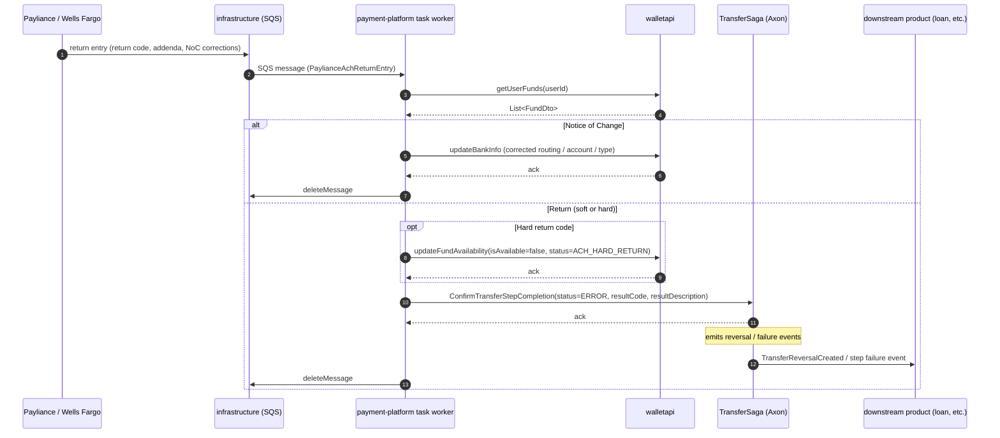

# ACH return (Payliance / Wells Fargo → reversed transfer step)

> **Status:** DRAFT — assembled from `PaylianceReturnProcessTask` (and the parallel Wells Fargo task); needs PM/engineer review.
> Open questions are tagged `<!-- TODO -->` inline.

## Participants

- **Payliance / Wells Fargo** (external) — ACH processor that detects the return (NSF, account closed, etc.) up to ~5 business days after origination and pushes a return record.
- **infrastructure** — provisions the SQS queue (`payliance-return` and a Wells Fargo equivalent) and the Payliance/WF ingress wiring (Lambda, S3, etc.) that lands the return entry on the queue. 
- **payment-platform** — `PaylianceReturnProcessTask` (and `WellsFargoReturnProcessTask`) drains the SQS queue, mutates state in `walletapi`, and tells the `TransferSaga` the step failed.
- **walletapi** — owner of `FundOption` records; updates bank info on Notice-of-Change, marks fund unavailable on hard returns.
- **TransferSaga** (Axon, in `payment-platform`) — reacts to the failed step; emits reversal / failure events that downstream products (loan, wallet UI, etc.) consume.

## Sequence

## When this fires

ACH origination is **optimistically settled** — `payment-platform` marks the originating step as successful when the file is accepted by the processor, but the funds are not truly final until the ACH return window closes (typically 2 business days for unauthorized debits, up to 60 days for consumer disputes; effectively ~5 business days for the common cases). When Payliance or Wells Fargo detects a return, the entry lands on a dedicated SQS queue (`paylianceReturnQueueUrl`); `PaylianceReturnProcessTask` polls in batches of 10 and processes each entry against the original `TransferStep` (looked up by `uniqueTransactionId == stepId`).

There are **two structurally different outcomes** for a single return entry:

1. **Notice of Change (NoC)** — not actually a return; the bank is telling us the account/routing/type is wrong. The task corrects the user's `FundOption` in `walletapi` via `updateBankInfo` and deletes the SQS message. The transfer itself stays settled.
2. **Actual return** — the task sends `ConfirmTransferStepCompletion` with status `ERROR` and the ACH return code; the saga then drives reversal and downstream notification. Hard return codes (see `AchHardReturnCodes`) additionally call `walletapi.updateFundAvailability(isAvailable=false, status=ACH_HARD_RETURN)` to stop future debits against the same account.

The SQS message is **only deleted after the Axon command resolves** (or after the wallet update succeeds for NoCs). On failure the message becomes visible again and is retried by the next poll — this is the primary retry mechanism.

## Pitfalls

- **`stepId == uniqueTransactionId`.** The whole flow assumes Payliance echoes our `stepId` back as `uniqueTransactionId`. Anything that changes how `stepId` is generated or sent to Payliance silently breaks return processing — returns will land for unknown steps and be discarded with a `get_transfer_step_view_erred` warning.
- **House-account legs use the literal user id `"moneylion"`.** The task derives `userId` by skipping `"moneylion"` legs (see `PaylianceReturnProcessTask` user-id resolution). Tooling that filters by user must mirror this.
- **NoC silently rewrites the user's bank account.** The task takes corrected routing/account/type from the return entry and overwrites the `FundOption` in `walletapi` without further user confirmation; this is by design but easy to miss when debugging "my bank account changed".
- **Hard-return classification lives in code, not data.** `AchHardReturnCodes.HARD_RETURN_CODES` is a hardcoded set; adding/removing a code requires a code change + redeploy, not a config flip. 
- **Wells Fargo runs a parallel pipeline** (`WellsFargoReturnProcessTask`, `WellsFargoReturnFileDownloadTask`, `WellsFargoRejectProcessTask`) with file-based ingestion rather than per-message webhooks. Any change to ACH return semantics must be applied to both.
- **No idempotency guard beyond SQS at-least-once.** A duplicated return entry would re-fire `ConfirmTransferStepCompletion`; the saga handler has to be idempotent for this to be safe. 
- **`AchTransferSettledExpired`** event in the saga implies a TTL/clearance signal exists separately from the return path — worth understanding alongside this flow if the question is "when is an ACH transfer truly final?".

