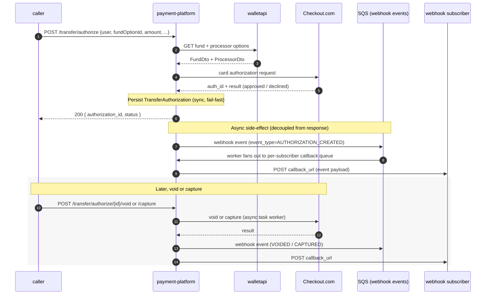

# Transfer authorization (synchronous card auth + async webhooks)

> **Status:** DRAFT — assembled from `TransferAuthorizationService`, ADR-0006, ADR-0007; needs PM/engineer review.
> Open questions are tagged `<!-- TODO -->` inline.

## Participants

- **caller** — product service that needs to put a hold on a card before later capturing or voiding (e.g. checkout-style flows). 
- **payment-platform** — exposes `POST /transfer/authorize`, runs the auth synchronously, persists `TransferAuthorization`, publishes webhook events.
- **walletapi** — supplies the user's `FundOption` + `ProcessorOption` for the card being authorized.
- **Checkout.com** (external) — the card processor that actually places the auth hold.
- **webhook subscribers** — clients that previously registered a `callback_url` for transfer-authorization events; receive `void` / `capture` / status-change notifications asynchronously.

## Sequence

## When this fires

A caller invokes `POST /transfer/authorize` to place a **hold** on a user's card before deciding to capture or void. Per ADR-0006 the endpoint is implemented as a **plain Spring Boot REST endpoint, not via the Axon `TransferSaga`** — it is fail-fast, synchronous, and has no long-lived aggregate. `TransferAuthorizationService` looks up the user's fund + processor through `walletapi`, delegates to `CheckoutCardAuthorizationService` (currently Checkout.com is the only processor for this path ), persists a `TransferAuthorization` row, and returns the result inline.

`void` and `capture` follow-up operations on the same authorization are **async** (per ADR-0007). Because the synchronous response can't carry a `callback_url` cleanly, the system uses a **webhook subscription model**: clients pre-register a `callback_url` + event-type subscription, and the platform fans out events through a two-stage SQS pipeline (event-context queue → transform worker → callback execution queue → dispatch worker). Retries are handled by SQS visibility timeouts on the second queue.

## Pitfalls

- **Two very different "transfer" flows live in `payment-platform`.** This sync auth flow shares almost no runtime code with the multi-step `TransferSaga` used by `wallet-topup` and similar; do not assume saga events fire here. The `Transfer` and `TransferAuthorization` aggregates are distinct.
- **The 200 response means "auth attempted and persisted", not "subscriber notified".** Webhook delivery is decoupled and can lag or fail silently from the caller's perspective.
- **Subscribers must opt in per event type.** A new event type added to the system is invisible to existing subscribers until they update their subscription — easy to miss in cross-team rollouts.
- **DB writes are transactional but webhook events are not part of the same transaction.** A crash between persisting the authorization and enqueueing the webhook event can leave the system in a state where the auth exists but no event ever fires. 
- **Auto-void exists.** The `AUTO_VOIDED_BY_PAYMENT_PLATFORM` constant in `TransferAuthorizationService` indicates the platform itself can void auths under some conditions (likely TTL expiry); subscribers must handle voids they did not request.
- `**capture` can be partial.** `CaptureTransferAuthorizationReq` carries an amount; subscribers/callers must reconcile partial captures against the original auth amount.

