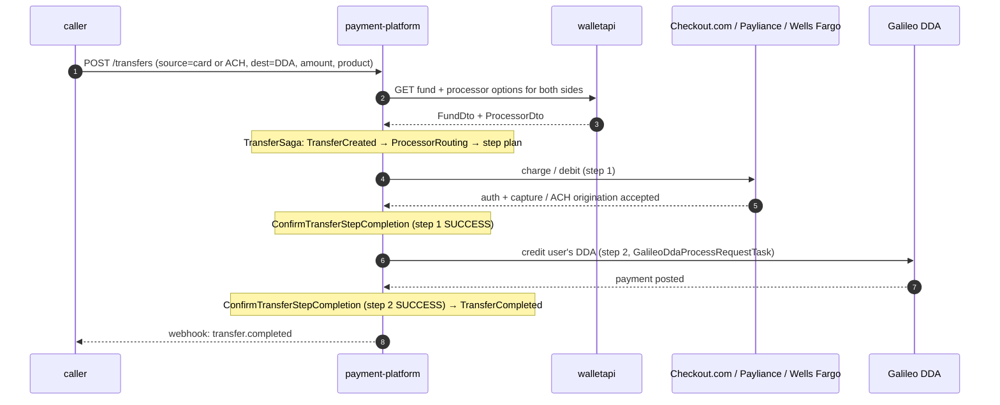

# Wallet topup (external fund → user's MoneyLion DDA)

> **Status:** DRAFT — assembled from code reading; needs PM/engineer review.
> Open questions are tagged `<!-- TODO -->` inline.

## Participants

- **caller** — product service or mobile-app BFF that initiates the topup. 
- **payment-platform** — orchestrates the multi-step transfer via the Axon `TransferSaga`.
- **walletapi** — source of truth for the user's `FundOption`s and `ProcessorOption`s; consulted for fund + processor lookup.
- **Checkout.com** (external) — debit/credit card processor when the topup source is a card.
- **Payliance / Wells Fargo** (external) — ACH origination when the topup source is a bank account.
- **Galileo DDA** (external) — destination ledger for the user's MoneyLion wallet account.

## Sequence

## When this fires

A "topup" is any `Transfer` whose **destination is the user's MoneyLion DDA** (Galileo) and whose **source is an external fund option** (a debit/credit card processed by Checkout.com, or a linked bank account processed via Payliance / Wells Fargo ACH). The caller `POST`s a transfer request with the user, the source/destination fund option IDs, an amount, and the originating product (`IC`, `LOAN`, `MEMBERSHIP`, etc. — see `Product` enum). `payment-platform` resolves both `FundOption`s through `walletapi`, picks a processor via `ProcessorRoutingSelectionService`, then runs the multi-step `TransferSaga` (Axon).

The success path is two steps: (1) pull funds from the external source (card capture or ACH debit), (2) credit the user's Galileo DDA. Each step emits `TransferStep…Confirmed` events; the saga only emits `TransferCompleted` after both steps succeed. Failures are step-local: a card decline at step 1 fails fast; a Galileo failure at step 2 triggers reversal of step 1 (`TransferReversalCreated`). ACH-funded topups are **not** considered final on origination — they remain "settled-pending-return" for the ACH return window (~5 business days) and can flip via the `ach-return` flow even after step 2 has credited the DDA. 

## Pitfalls

- **Topup is not a single concept in code.** There is no `Topup` class — it is a `Transfer` with destination = Galileo DDA. Any change to "topup behavior" is really a change to the saga, the routing service, or one of the processor tasks.
- **ACH-funded topups can reverse days later.** The DDA credit may post immediately but the funds are not truly final until the ACH return window closes; a hard return triggers fund-availability changes in `walletapi` and a step failure in the saga. See `ach-return.md`.
- `**walletapi` is consulted multiple times per saga step**, not just at saga start (fund lookup, processor lookup, sometimes bank-info update). N+1 risk if a feature adds another lookup per step.
- **Processor routing is feature-flagged** (`SplitFeature`, Split.io); the same topup request can take a different processor path between users or environments. Reproduction requires matching feature-flag treatment.
- **Idempotency is per-`stepId`, not per-request.** Retries on the SQS task queues are safe (deduped by `stepId` / `uniqueTransactionId`), but a caller retrying the original `POST /transfers` will create a *new* transfer aggregate. 
- `**moneylion` is sometimes a magic user id** for house-account legs (see `PaylianceReturnProcessTask` user-id derivation). Tooling that filters by user must handle the literal string.

